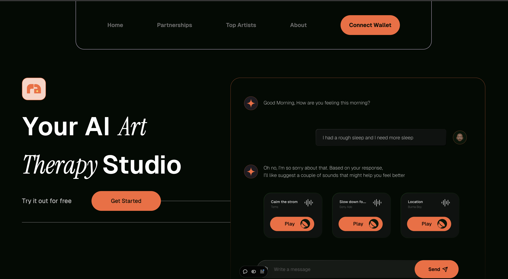
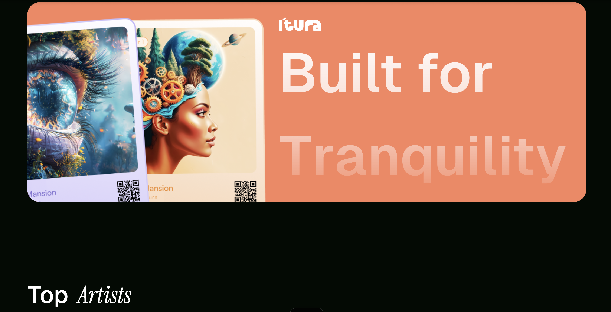

# Itura: AI and Blockchain Powered NFT Art Therapy
 

## Overview
Itura is a decentralized application (dApp) built on the Optimism Sepolia blockchain, aimed at promoting mental wellness through personalized art therapy. Leveraging AI, users are guided through a creative process that includes generating art based on their emotional state, completing guided meditations, and minting their finished artwork as NFTs. Itura creates a unique intersection between art, technology, and mental health, empowering users to express themselves and own their digital creations.

## Features
- **AI-Powered Personalization**: Users receive tailored art prompts and guided meditations based on a quick mood assessment, creating a personalized and therapeutic experience.
- **NFT Minting**: After completing their digital artwork, users can mint it as an NFT on Ethereum, allowing them to own and potentially monetize their creations.
- **Music Generation**: Users can generate custom soundscapes or music tracks that align with their emotional state, enhancing their relaxation or creative flow through audio tailored to their mood prompts.
- **Community-Driven Marketplace**: A platform for users to showcase, trade, and collect NFTs, fostering a supportive community around mental wellness and creativity.
- **Art Creation Tools**: Intuitive digital art tools designed for a smooth and inspiring creative process, accessible to all users.
- **Onboarding Experience**: A welcoming, user-friendly interface that includes mood assessments, guided instructions, and wallet connection for NFT functionality.
- **Calming Design**: A clean, visually serene UI with calming colors and simple animations to enhance the user’s experience.

## Problem It Solves
Mental wellness often lacks accessible, creative outlets for self-expression and healing. Traditional therapy can be expensive and intimidating, while digital platforms rarely offer a personalized and engaging experience focused on mental health. Itura bridges this gap by offering a decentralized platform that empowers users to explore their emotions and creativity through art therapy, all while benefiting from the ownership and monetization capabilities provided by blockchain technology.

## Screenshots

## Technology Stack
- **Frontend**:
  - React
  - Web3modal
  - Daisy UI
  - Ethers
  - React Toastify
- **Blockchain**: Optimism Sepolia for secure NFT minting and decentralized marketplace features.
- **Smart Contracts**: Solidity and OpenZeppelin libraries to manage NFT creation and transactions.
- **AI Integration**: AI models to generate personalized art prompts and guided meditations based on user input.
  - suno ai for music
  - Midjourney for images
- **CSS Framework**: TailwindCSS for responsive design and user-friendly interfaces.
- **Storage**: IPFS or decentralized storage for the digital art files and NFTs.

## Links

- NFT deployed at: `0x878b07F941D99dE6c0E6d7F0ea557c0fC69a8E84`
- Marketplace deployed at: `0x22Da299138720d6d4bd838649B01AE0D965D0e2c`
- [Livelink](https://itura-topaz.vercel.app/)

## Team

- Jo Edor - Project Manager
- Dave - UX Designer
- Mayowa - Smart Contract Developer
- Kemi - Front-End Developer